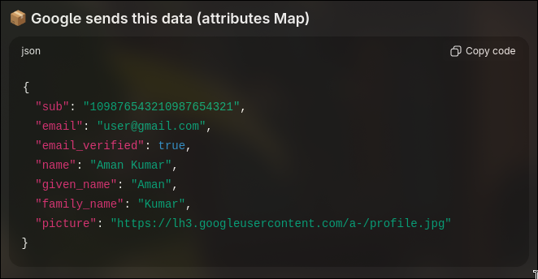
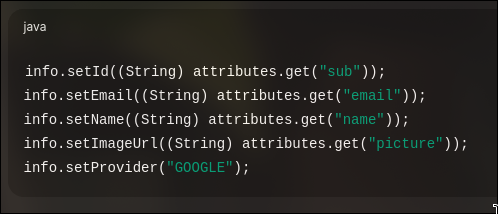
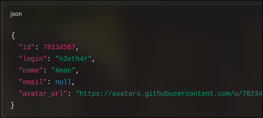

## Purpose

Represents application users for:

- Email/Password login
- Google OAuth2
- GitHub OAuth2

---

## Core Annotations

### @Entity

- Marks class as JPA entity
- Mapped to a database table

**Interview:** Identifies a persistent JPA entity.

---

### @Table(name = "users")

- Maps entity to `users` table

**Interview:** Used when table name differs from class name.

---

### @Id

- Primary key of table

**Interview:** Identifies unique row in table.

---

### @GeneratedValue(strategy = GenerationType.IDENTITY)

- Auto-increment handled by DB

**Interview:** Uses database identity column.

---

### @Column(unique = true)

- Enforces uniqueness (email)

**Interview:** Prevents duplicate records at DB level.

---

### @Column(name = "profile_picture")

- Custom DB column name

**Interview:** Maps field to different column name.

---

## Enum Mapping

### @Enumerated(EnumType.STRING)

- Stores enum as readable string
- Safer than ORDINAL like google github and via email

## OAuth2UserInfo –Quick Notes

### Purpose

Normalizes OAuth2 user data from different providers into a common structure.

---

### Why Needed

- Google and GitHub return different attribute keys
- Avoids provider-specific logic in service layer
- Improves code readability and scalability

---

### Design Pattern Used

Factory Method Pattern

---

static :) Object banaye bina call ho sakta ha

static Factory Methods

- Belong to class, not object
- Used for object creation
- Hide provider-specific mapping logic

### Factory Methods

- fromGoogle(Map<String, Object>)
  
  CODE MAPPING OF GOOGLE
  

- fromGitHub(Map<String, Object>)
  

Each method:

- Extracts provider-specific fields
- Maps them to common fields
- Sets provider name

---

### Google Mapping

| OAuth Field | App Field |
| ----------- | --------- |
| sub         | id        |
| email       | email     |
| name        | name      |
| picture     | imageUrl  |

---

### GitHub Mapping

| OAuth Field | App Field      |
| ----------- | -------------- |
| id          | id             |
| email       | email          |
| login       | email fallback |
| avatar_url  | imageUrl       |

---

### Special Case

GitHub may return null email → fallback used.

---

### One-LineSummary

OAuth2UserInfo converts provider-specific OAuth responses into a unified user representation using factory methods.
